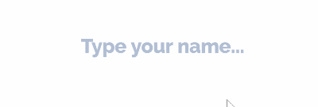

<p align="center">
    <a href="https://travis-ci.org/Cobertos/vue-contenteditable-input" target="_blank"></a>
    <a href="https://twitter.com/cobertos" target="_blank"></a>
    <a href="https://cobertos.com" target="_blank"></a>
</p>

# vue-input-contenteditable

Make beautiful inputs without the restrictions of `input[type='text']`. A Vue component wrapper for `contenteditable` with all the features you expect:

 * v-model
 * placeholder
 * maxlength

<p align="center">
    
</p>

## Usage

```
<input-contenteditable
    v-model="someModel"
    :placeholder="myPlaceHolder"
    :maxlength="22" />
```

### Developing
#### Testing

```
npm run test:unit
npm run test:unit -- --watch
npm run lint --no-fix
...
```
